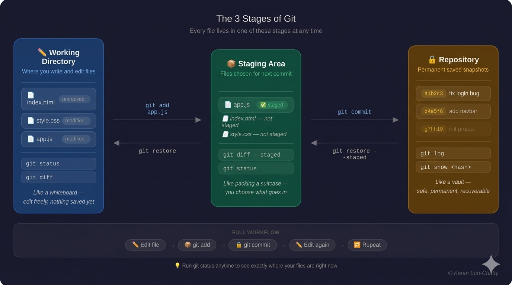

# 1- Fundamental Concepts >> [View all commands for this section](./COMMANDS.md)

In this section, you will build a solid mental model of Git.
what it is?, why it exists?, and how it works under the hood. This foundation will make every other section much easier to understand.

---

## What is Git?

Git is a **version control system** ,it tracks changes in your files over time so you can go back to any previous version, see what changed, and collaborate with others without overwriting each other's work.

Think of it like a save system in a video game — but for your code. Every time you commit, Git saves a snapshot of your project.

**Without Git:**

- You end up with files like `project_final.js`, `project_final_v2.js`, `project_REAL_final.js`
- You can't easily undo mistakes
- Collaborating with others becomes a nightmare

**With Git:**

- Every change is tracked
- You can go back to any point in history
- Multiple people can work on the same project without conflicts

---

## How Git Works

Most version control systems track **differences** (what changed line by line). Git is different — it takes a **snapshot** of your entire project every time you commit.

If a file didn't change, Git doesn't store it again — it just points to the previous snapshot. This makes Git fast and efficient.

```
Commit 1  →  Snapshot of all files
Commit 2  →  Snapshot of all files (only changed files are stored again)
Commit 3  →  Snapshot of all files
```

**Real example:**
Imagine you have 3 files: `index.html`, `style.css`, `app.js`

- You commit all 3 → Git saves a snapshot of all 3
- You edit only `app.js` and commit again → Git saves a new snapshot of `app.js`, and points to the old `index.html` and `style.css`

> 💡 This is why Git is so fast — it doesn't re-store files that haven't changed.

## Installing Git

**Windows:**

1. Go to https://git-scm.com
2. Download and run the installer
3. Keep all default settings

**macOS:**

```bash
brew install git
```

**Linux (Ubuntu/Debian):**

```bash
sudo apt update
sudo apt install git
```

**Verify installation:**

```bash
git --version
```

You should see something like `git version 2.43.0`

### To Do

Install Git on your machine and run `git --version` in your terminal. Make sure you see a version number.

---

## Configuring Git

Before using Git, you need to tell it who you are. This information is attached to every commit you make.

```bash
git config --global user.name "Your Name"
git config --global user.email "you@example.com"
```

**Set your default editor** (optional but useful):

```bash
# VSCode
git config --global core.editor "code --wait"

# Vim
git config --global core.editor "vim"
```

**Check your configuration:**

```bash
git config --list
```

> 💡 The `--global` flag means this config applies to all your repos on this machine. Remove it to set config for just one repo.

### To Do

1. Set your name and email using `git config --global`
2. Run `git config --list` and verify your name and email appear correctly

---

## The Three Stages

This is the most important concept to understand in Git. Every file in your project lives in one of three stages:



| Stage                 | What it means                                                     |
| --------------------- | ----------------------------------------------------------------- |
| **Working Directory** | Where you write and edit your files normally (local in ur laptop) |
| **Staging Area**      | Where you prepare files before saving a snapshot                  |
| **Repository**        | Where Git permanently stores your snapshots (commits)             |

**Real example:**

```bash
# You edit app.js in your working directory
# Then stage it (move it to staging area)
git add app.js

# Then commit it (move it to the repository)
git commit -m "fix login bug"
```

> 💡 The staging area gives you control — you can choose exactly which changes go into a commit, even if you edited many files.

### To Do

In your own words, explain the three stages to someone who has never used Git. Can you think of a real-life analogy for each stage?

---

## The Git Workflow

Now that you know the three stages, here is what a typical Git session looks like:

```
1. Make changes to your files (Working Directory)
2. Stage the changes you want to save (git add)
3. Commit the snapshot (git commit)
4. Repeat
```

**Real example — a full workflow:**

```bash
# Start a new project
git init

# Create a file and edit it
echo "hello world" > index.html

# Check what Git sees ,It tells you exactly what state every file is in at any moment.
git status

# Stage the file
git add index.html

# Save the snapshot
git commit -m "add index.html"

# Make another change
echo "<h1>Git Mastery</h1>" >> index.html

# Stage and commit again
git add index.html
git commit -m "add heading to index.html"
```

> 💡 `git status` is your best friend — run it constantly to see where your files are in the three stages.

### To Do

1. Create a new folder on your desktop
2. Run `git init` inside it
3. Create a file, stage it, and commit it` git add`
4. Edit the file again, stage it, and make a second commit
5. Run `git log` to see your two commits in history

---

**From Learner to Leader**
Made with ❤️ by [Karim Ech-Chatty](https://www.linkedin.com/in/karim-chatty)
