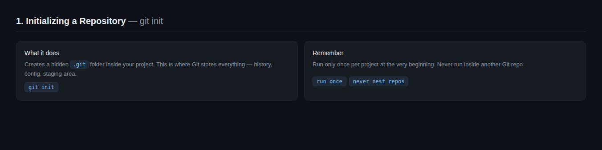
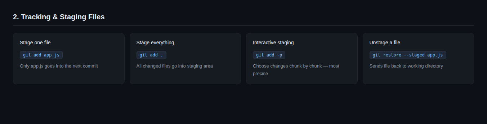
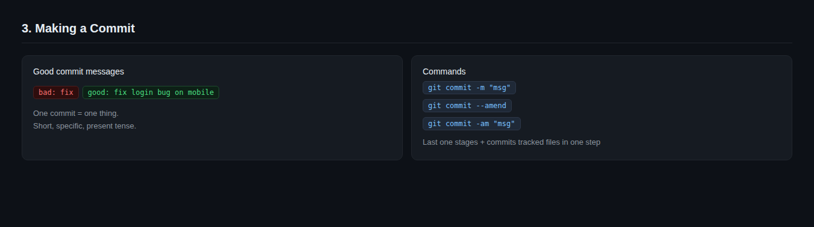
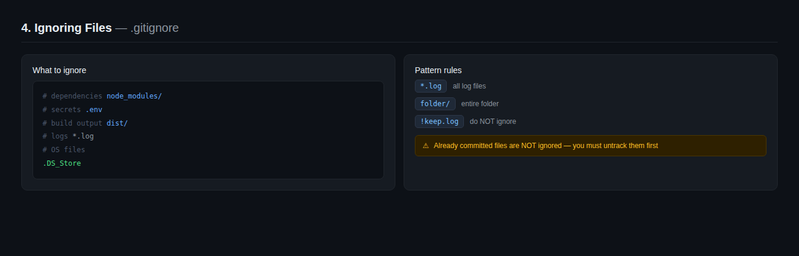
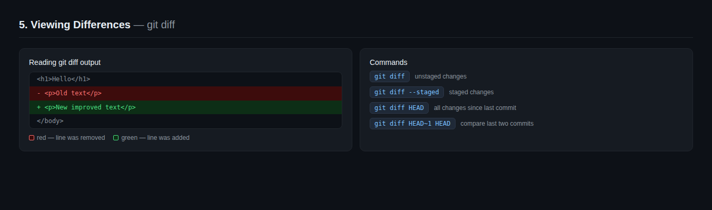

# 2. Creating Snapshots [View all commands for this section](./COMMANDS.md)

In this section, you will learn how to tell Git what to track and when to save your progress. Every commit is a snapshot of your project at a specific point in time.

---

## Initializing a Repository



Before Git can track anything, you need to initialize a repository inside your project folder. This creates a hidden `.git` folder where Git stores everything.

```bash
git init
```

**What happens behind the scenes:**

- Git creates a `.git` folder in your project
- This folder contains your entire history, config, and staging area
- Without it, Git knows nothing about your project

**Real example:**

```bash
mkdir my-project
cd my-project
git init
# Initialized empty Git repository in /my-project/.git/
```

> 💡 You only run `git init` once per project — at the very beginning.

### To Do

1. Create a new folder called `snapshot-practice`
2. Run `git init` inside it
3. Run `ls -a` — can you see the `.git` folder?
4. Run `git status` — what does Git tell you?

---

## Tracking & Staging Files



Git does not track files automatically. You have to tell it which files to watch and which changes to include in the next snapshot.

**Two steps to stage files:**

```bash
# Stage a specific file
git add filename.js

# Stage all files at once
git add .

# Stage all files with a specific extension
git add *.js

# Stage changes interactively line by line
git add -p
```

**What `git add -p` does:**
It goes through your changes chunk by chunk and asks you `stage this? (y/n)` — powerful when you want to commit only part of a file.

**Real example:**

```bash
# You edited 3 files but only want to commit one
git add app.js

# Check what is staged
git status

# Only app.js will go into the next commit
```

### TO Do

1. Create 3 files: `index.html`, `style.css`, `app.js`
2. Run `git status` — what do you see?
3. Stage only `index.html`
4. Run `git status` again — notice the difference between staged and untracked files
5. Now unstage it using `git restore --staged index.html`
6. Run `git status` one more time — is it back to untracked?

---

## Making Your First Commit



A commit is a permanent snapshot of everything in your staging area. Every commit needs a message that describes what changed and why.

```bash
git commit -m "your message here"
```

**What makes a good commit message:**

| Bad ❌   | Good ✅                                  |
| -------- | ---------------------------------------- |
| `fix`    | `fix login bug on mobile`                |
| `update` | `update navbar color to match brand`     |
| `stuff`  | `add user authentication feature`        |
| `wip`    | `add form validation — work in progress` |

**Real example:**

```bash
git add index.html
git commit -m "add homepage structure"

git add style.css
git commit -m "add base styles and typography"
```

> 💡 Commit often and keep messages short and specific.
> One commit = one thing. Don't mix unrelated changes.

### To Do

1. Stage all 3 files from the previous exercise
2. Make your first commit with a meaningful message
3. Edit `index.html` and make a second commit
4. Run `git log --oneline` — you should see both commits
5. **Tricky:** try `git commit --amend` to fix your last commit message

---

## Ignoring Files with `.gitignore`



Some files should never be committed — passwords, API keys, log files, dependencies, and build outputs. The `.gitignore` file tells Git to completely ignore them.

**Create a `.gitignore` file in your project root:**

```bash
touch .gitignore
```

**Common things to ignore:**

```gitignore
# Dependencies
node_modules/

# Environment variables and secrets
.env
.env.local

# Build outputs
dist/
build/

# Log files
*.log

# OS files
.DS_Store
Thumbs.db

# Editor files
.vscode/
.idea/
```

**How it works:**

- `filename.txt` — ignores a specific file
- `*.log` — ignores all files with `.log` extension
- `folder/` — ignores an entire folder
- `!important.log` — the `!` means do NOT ignore this file

**Real example:**

```bash
# You have a .env file with your database password
# Add it to .gitignore so it never gets committed

echo ".env" >> .gitignore
git add .gitignore
git commit -m "add gitignore"
```

> 💡 Always create your `.gitignore` at the start of a project
> before you make your first commit.

### To Do

1. Create a `.env` file and write `PASSWORD=secret123` inside it
2. Run `git status` — Git sees it
3. Add `.env` to your `.gitignore`
4. Run `git status` again — has the `.env` file disappeared from the list?
5. **Tricky:** what happens if you already committed `.env` before adding it to `.gitignore`? Google it and find out.

---

## Viewing the Status

`git status` is the most useful command in Git. It shows you exactly where every file is across the three stages at any moment.

```bash
git status
```

**Reading the output:**

```bash
On branch main

Untracked files:
  index.html          ← new file Git has never seen

Changes not staged for commit:
  modified: style.css ← edited but not staged yet

Changes to be committed:
  modified: app.js    ← staged and ready to commit

nothing to commit, working tree clean ← everything is saved
```

| Output                    | What it means                   |
| ------------------------- | ------------------------------- |
| `Untracked files`         | New files Git doesn't know yet  |
| `Changes not staged`      | Edited files not yet added      |
| `Changes to be committed` | Staged files ready for commit   |
| `nothing to commit`       | All clean — everything is saved |

> 💡 Run `git status` after every single command until it becomes habit.

### To Do

1. Create a new file — run `git status`
2. Stage the file — run `git status`
3. Commit it — run `git status`
4. Edit the file — run `git status`
5. Notice how the output changes at each step

---

## Viewing Differences



`git diff` shows you exactly what changed line by line — before and after.

```bash
# See changes in working directory (not yet staged)
git diff

# See changes that are staged (ready to commit)
git diff --staged

# Compare two specific commits
git diff a1b2c3 d4e5f6

# Compare with previous commit
git diff HEAD~1 HEAD
```

**Reading the output:**

```bash
- old line that was removed    ← shown in red with a minus
+ new line that was added      ← shown in green with a plus
  unchanged line               ← shown in white, no symbol
```

**Real example:**

```bash
# You edited index.html
git diff index.html

# Output:
- <h1>Hello</h1>
+ <h1>Hello Git</h1>
```

### To Do

1. Edit a file without staging it — run `git diff`
2. Stage the file — run `git diff` again. What happened?
3. Now run `git diff --staged` — what do you see?
4. Make a commit, then edit the file again
5. **Tricky:** run `git diff HEAD` — what is the difference between this and `git diff`?

---

**From Learner to Leader**
Made with ❤️ by [Karim Ech-Chatty](https://www.linkedin.com/in/karim-chatty)
