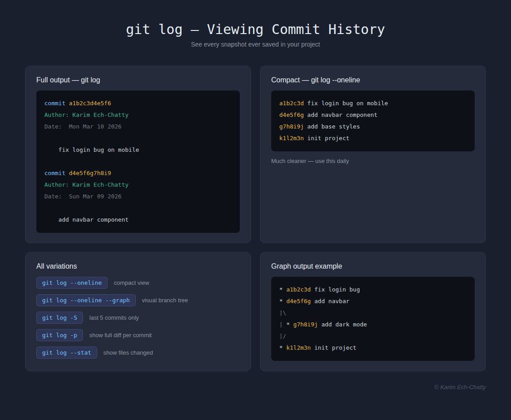
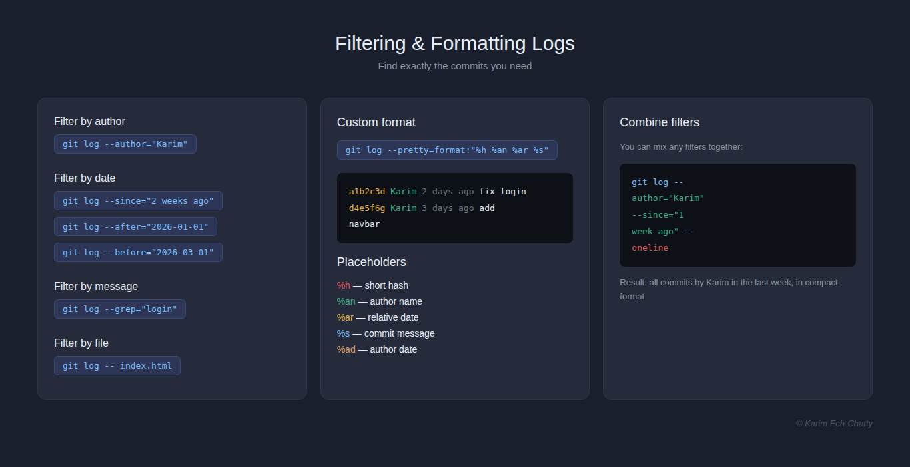
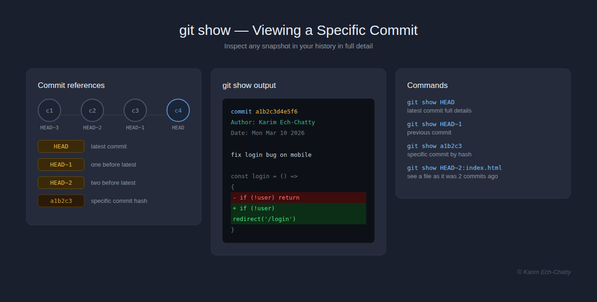
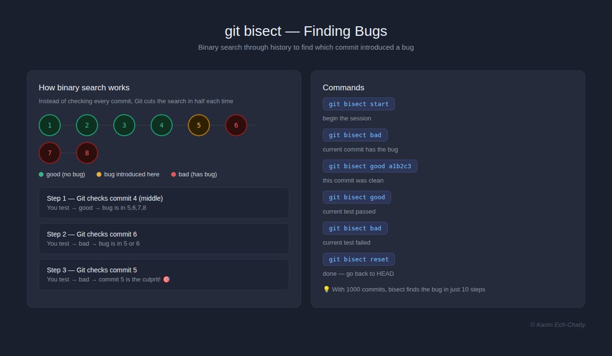
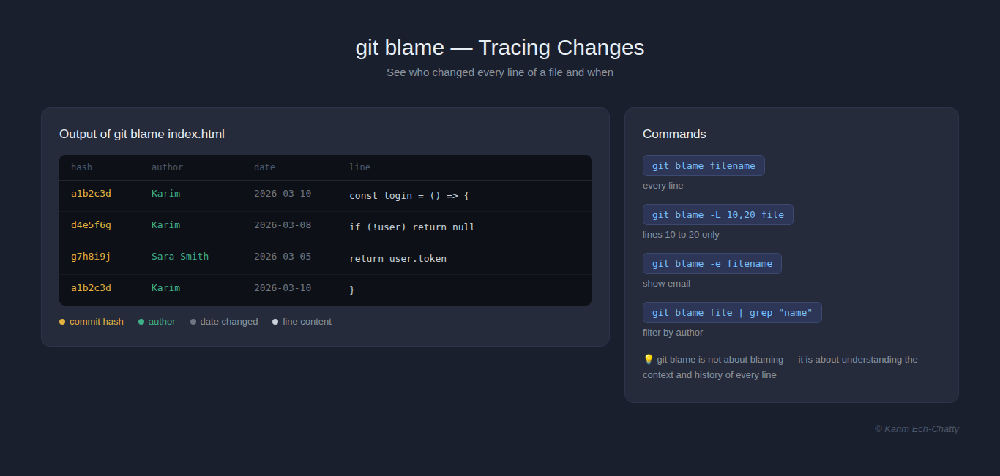

# 3. Browsing Project History [View all commands for this section](./COMMANDS.md)

In this section, you will learn how to navigate and search your project history. Git stores everything — and knowing how to read that history is a superpower.

---

## Viewing Commit History



`git log` shows you every commit ever made in your project — who made it, when, and what changed.

```bash
git log
```

**Full output:**

```bash
commit a1b2c3d4e5f6...
Author: Karim EchChatty <karim@example.com>
Date:   Mon Mar 10 2026

    fix login bug on mobile
```

**Useful variations:**

| Command                     | What it does                            |
| --------------------------- | --------------------------------------- |
| `git log`                   | Full commit history                     |
| `git log --oneline`         | One line per commit — clean and compact |
| `git log --oneline --graph` | Visual branch tree in terminal          |
| `git log --oneline --all`   | Show all branches history               |
| `git log -5`                | Show only last 5 commits                |
| `git log -p`                | Show commits with full diff of changes  |
| `git log --stat`            | Show which files changed in each commit |

> 💡 `git log --oneline` is the one you will use the most — clean, fast, and easy to read.

### To Do

1. Run `git log` in your project — read the full output carefully
2. Run `git log --oneline` notice how much cleaner it is
3. Run `git log --oneline --graph` can you see the branch structure?
4. Run `git log --stat` which files changed in each commit?

---

## Filtering & Formatting Logs



Git log is very powerful — you can filter by author, date, message, and even format the output exactly how you want.

**Filter by author:**

```bash
git log --author="Karim"
```

**Filter by date:**

```bash
git log --since="2 weeks ago"
git log --after="2026-01-01"
git log --before="2026-03-01"
```

**Filter by message keyword:**

```bash
git log --grep="login"
```

**Filter by file:**

```bash
git log -- filename.js
```

**Custom format:**

```bash
git log --pretty=format:"%h — %an — %ar — %s"
```

| Placeholder | What it shows                   |
| ----------- | ------------------------------- |
| `%h`        | Short commit hash               |
| `%an`       | Author name                     |
| `%ar`       | Relative date (e.g. 2 days ago) |
| `%s`        | Commit message subject          |
| `%ad`       | Author date                     |

> 💡 You can combine filters:
> `git log --author="Karim" --since="1 week ago" --oneline`

### To Do

1. Filter commits by your own name using `--author`
2. Find commits from the last 7 days using `--since`
3. Search for a specific word in your commit messages using `--grep`
4. **Tricky:** combine three filters in one command and see what comes out

---

## Viewing a Specific Commit



Once you find a commit in `git log`, you can inspect it in detail using `git show`.

```bash
git show a1b2c3
```

**What it shows:**

- The commit hash, author, date, and message
- The full diff of every file that changed

**Other useful ways to reference commits:**

| Reference | What it means                 |
| --------- | ----------------------------- |
| `HEAD`    | Your latest commit            |
| `HEAD~1`  | One commit before HEAD        |
| `HEAD~2`  | Two commits before HEAD       |
| `a1b2c3`  | A specific commit by its hash |

```bash
# Show latest commit
git show HEAD

# Show commit before latest
git show HEAD~1

# Show specific file in a specific commit
git show HEAD~2:index.html
```

> 💡 You don't need the full hash — just the first 6-7 characters are enough.
> Git is smart enough to find the right commit.

### To Do

1. Run `git log --oneline` and pick any commit hash
2. Run `git show <hash>` — read the output carefully
3. Run `git show HEAD` — is it the same as your latest commit?
4. **Tricky:** run `git show HEAD~1:index.html` — what do you see?

---

## Comparing Commits

`git diff` lets you compare any two points in your history — commits, branches, or files.

```bash
# Compare two specific commits
git diff a1b2c3 d4e5f6

# Compare with previous commit
git diff HEAD~1 HEAD

# Compare a specific file between two commits
git diff HEAD~1 HEAD -- index.html

# Compare working directory with a specific commit
git diff a1b2c3
```

**Reading the output:**

```bash
- old line that was removed    ← shown in red
+ new line that was added      ← shown in green
  unchanged line               ← shown in white
```

| Command                 | What it compares        |
| ----------------------- | ----------------------- |
| `git diff HEAD~1 HEAD`  | Last two commits        |
| `git diff a1b2 d4e5`    | Any two commits         |
| `git diff HEAD~3 HEAD`  | Last 3 commits combined |
| `git diff main feature` | Two branches            |

### To Do

1. Make 3 commits with small changes
2. Run `git diff HEAD~2 HEAD` — can you see all 3 changes combined?
3. Run `git diff HEAD~1 HEAD -- index.html` — filter to just one file
4. **Tricky:** what is the difference between `git diff HEAD` and `git diff HEAD~1 HEAD`?

---

## Finding Bugs with git bisect



`git bisect` is one of Git's most powerful tools. It uses binary search to find exactly which commit introduced a bug — without checking every commit manually.

```bash
# Start bisect
git bisect start

# Tell Git the current commit is bad (has the bug)
git bisect bad

# Tell Git a commit that was good (no bug)
git bisect good a1b2c3

# Git will checkout the middle commit
# Test your code, then tell Git if it's good or bad
git bisect good   # or
git bisect bad

# Git keeps narrowing down until it finds the culprit
# When done, reset back to HEAD
git bisect reset
```

**How it works:**

```
100 commits → bisect picks commit 50
→ bad → bisect picks commit 25
→ good → bisect picks commit 37
→ bad → bisect picks commit 31
→ found the bug commit!
```

> 💡 Even with 1000 commits, bisect finds the bug in just 10 steps.
> That is the power of binary search.

### To Do

1. Create a repo with 5 commits — introduce a bug in commit 3
2. Start `git bisect` and mark the latest as bad
3. Mark the first commit as good
4. Follow Git's instructions until it finds commit 3
5. Run `git bisect reset` when done

---

## Tracing Changes with git blame



`git blame` shows you who changed every single line of a file — and when. Useful for understanding why something was written a certain way.

```bash
git blame filename.js
```

**Output:**

```bash
a1b2c3d4 (Karim Ech-Chatty  2026-03-10) const login = () => {
d4e5f6g7 (Karim Ech-Chatty  2026-03-08)   if (!user) return null
g7h8i9j0 (Sara Smith         2026-03-05)   return user.token
```

Each line shows:

- The **commit hash** where this line was last changed
- The **author** who changed it
- The **date** it was changed
- The **line content**

**Useful options:**

| Command                                    | What it does                |
| ------------------------------------------ | --------------------------- |
| `git blame filename`                       | Show who changed every line |
| `git blame -L 10,20 filename`              | Show only lines 10 to 20    |
| `git blame -e filename`                    | Show email instead of name  |
| `git blame --since="2 weeks ago" filename` | Limit to recent changes     |

> 💡 `git blame` is not about blaming people — it is about
> understanding the history and context of every line of code.

### To Do

1. Run `git blame` on any file in your project
2. Run `git blame -L 1,5 filename` — show only the first 5 lines
3. Pick a commit hash from the blame output and run `git show <hash>`
4. **Tricky:** find a line changed by a specific author using `git blame` and `grep`:

```bash
git blame filename | grep "Karim"
```

---

**From Learner to Leader**
Made with ❤️ by [Karim Ech-Chatty](https://www.linkedin.com/in/karim-chatty)
