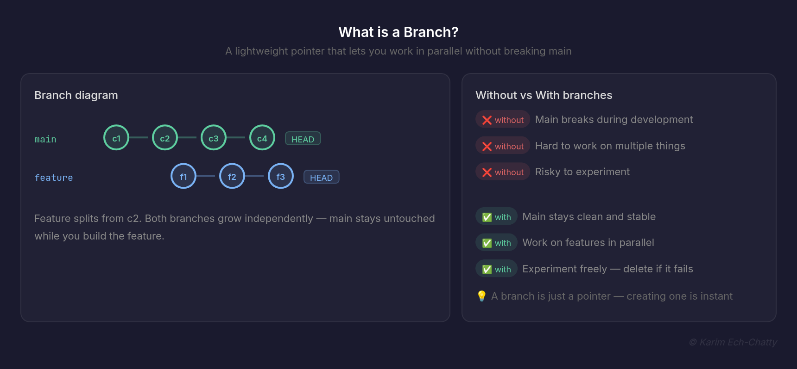
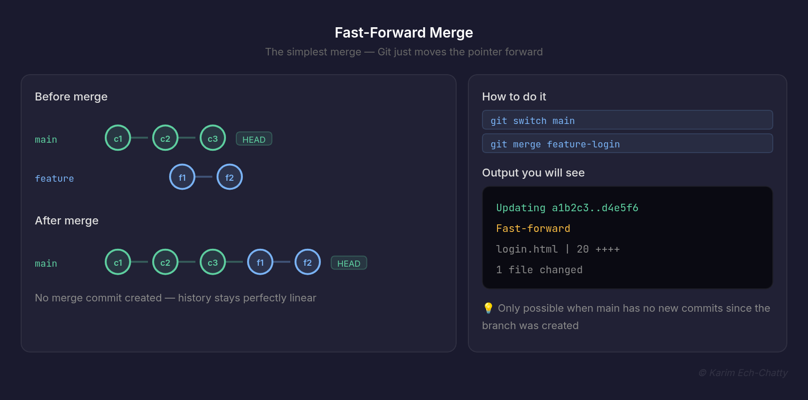
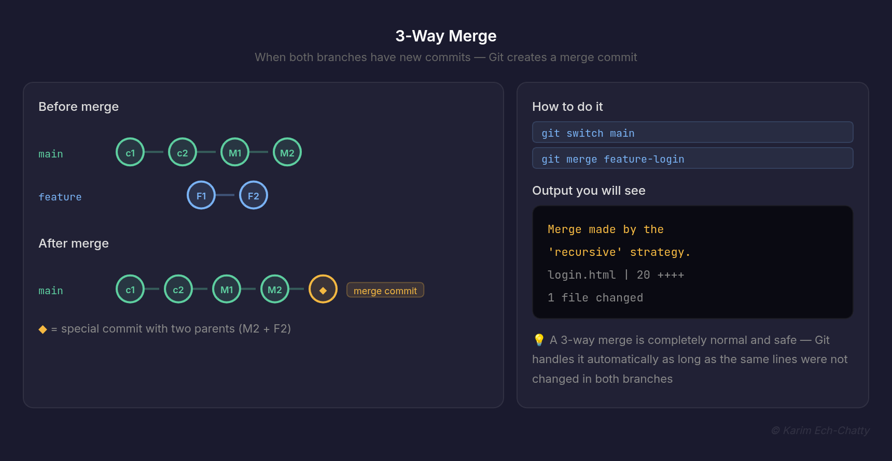
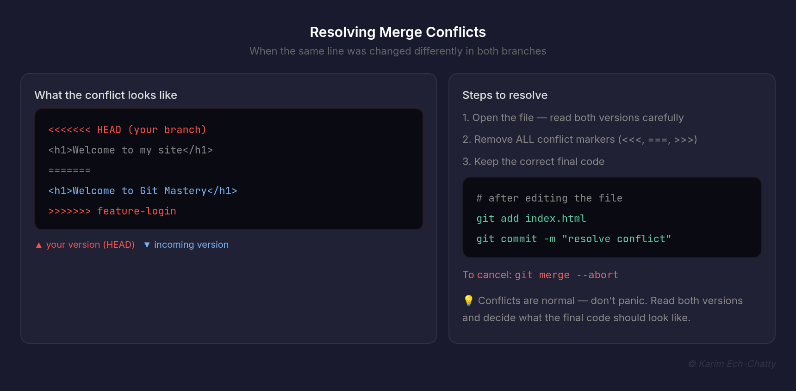
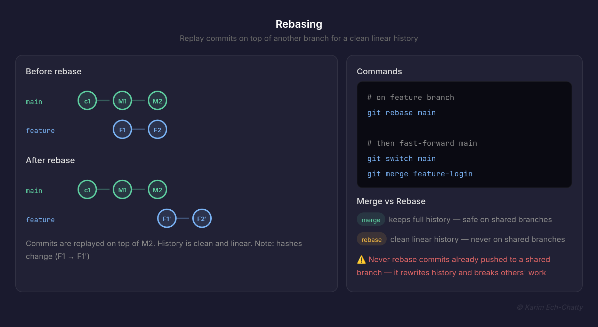

# 4. Branching & Merging [View all commands for this section](./COMMANDS.md)

In this section, you will learn how to work on multiple things at once without breaking your main code. Branching is one of Git's most powerful and essential features.

---



## What is a Branch?

A branch is simply a lightweight movable pointer to a commit. When you create a branch, Git doesn't copy your entire project — it just creates a new pointer. This makes branches incredibly fast and cheap to create.

Let's say your website is working now, and you want to add a payment method feature. You create a branch for this feature and start working, making commits as you go.
Suddenly, you get a report that the login page is broken. What do you do?

Solution:
Switch back to your main branch (which is stable)
,Create a new branch for the login fix
,Fix the login issue and deploy it
,Switch back to your payment method branch and continue working

**Why use branches?**

| Without branches                           | With branches                                          |
| ------------------------------------------ | ------------------------------------------------------ |
| You break main code while adding features  | Main code stays safe and clean                         |
| Hard to work on multiple things at once    | Work on multiple features in parallel                  |
| Risky to experiment with new ideas         | Experiment freely — just delete the branch if it fails |
| Collaborating with others causes conflicts | Each person works on their own branch                  |

**How Git thinks about branches:**

```
main    ●───●───●───●  (your stable code)
                  \
feature            ●───●───●  (your new feature)
```

> 💡 The default branch is called `main` (or `master` in older repos).
> Every repo starts with one branch. You create more as you need them.

### To Do

1. Run `git branch` in your project — what do you see?
2. Think of a feature you could build — what would you name the branch?
3. Run `git log --oneline --graph --all` — can you see the branch structure?

---

## Creating & Switching Branches


Creating a branch is instant — Git just creates a new pointer.

```bash
# Create a new branch
git branch feature-login

# Switch to it
git switch feature-login

# Create AND switch in one command (recommended)
git switch -c feature-login

# Old way (still works)
git checkout -b feature-login
```

**Listing and deleting branches:**

```bash
# List all local branches
git branch

# List all branches including remote
git branch -a

# Delete a branch (safe — won't delete unmerged)
git branch -d feature-login

# Force delete a branch
git branch -D feature-login

# Rename a branch
git branch -m old-name new-name
```

**Real example — full workflow:**

```bash
# You want to add a login feature
git switch -c feature-login

# Work on the feature
# edit files...
git add .
git commit -m "add login form"
git commit -m "add login validation"

# Done — go back to main
git switch main
```

> 💡 Always create a new branch before starting any new feature.
> Never work directly on main.

### To Do

1. Create a branch called `feature-about-page`
2. Add a new file `about.html` and commit it
3. Switch back to `main` — is `about.html` still there?
4. Run `git log --oneline --all` — can you see both branches?
5. **Tricky:** create a branch from a specific commit:

```bash
git switch -c fix-old-bug a1b2c3
```

---

## Fast-Forward Merges

A fast-forward merge is the simplest kind of merge. It happens when the branch you are merging has no conflicts with main — Git simply moves the main pointer forward.



```
Before merge:
main    ●───●───●
                 \
feature           ●───●───●

After fast-forward merge:
main    ●───●───●───●───●───●
```

**How to do it:**

```bash
# Switch to main first
git switch main

# Merge the feature branch
git merge feature-login
```

**Output you will see:**

```bash
Updating a1b2c3..d4e5f6
Fast-forward
 login.html | 20 ++++++++++++++++++++
 1 file changed, 20 insertions(+)
```

> 💡 Fast-forward only works when main has not changed since you
> created the feature branch. If main has new commits, Git does a 3-way merge or rebase instead.

### To Do

1. Create a branch `feature-footer` from main
2. Add a commit on the feature branch
3. Switch back to main — do NOT add any commits here
4. Run `git merge feature-footer` — you should see "Fast-forward"
5. Run `git log --oneline` — notice main now points to the same commit as the feature branch

---

## 3-Way Merges

A 3-way merge happens when both main and your feature branch have new commits since they diverged. Git uses 3 snapshots to combine them, the tip of main, and the tip of the feature branch.



```
Before merge:
main    ●───●───●───M1───M2
                 \
feature           ●───F1───F2

After 3-way merge:
main    ●───●───●───M1───M2───◆  (merge commit)
                 \           /
feature           ●───F1───F2
```

**How to do it:**

```bash
git switch main
git merge feature-login
```

**Output you will see:**

```bash
Merge made by the 'recursive' strategy.
 login.html | 20 ++++++++++++++++++++
 1 file changed, 20 insertions(+)
```

Git creates a **merge commit** — a special commit with two parents.

> 💡 A 3-way merge is completely normal and safe.
> Git handles it automatically as long as the same lines were not changed in both branches.

### To Do

1. Create a branch `feature-contact`
2. Add a commit on the feature branch
3. Switch back to main and add a different commit (edit a different file)
4. Run `git merge feature-contact` — you should see "Merge made by recursive strategy"
5. Run `git log --oneline --graph` — you should see the merge commit with two parents

---

## Resolving Merge Conflicts

A merge conflict happens when the same line of the same file was changed differently in both branches. Git cannot decide which version to keep — so it asks you to decide.



**When conflicts happen:**

```bash
git merge feature-login
# CONFLICT (content): Merge conflict in index.html
# Automatic merge failed; fix conflicts and then commit the result.
```

**What the conflict looks like inside the file:**

```
<<<<<<< HEAD
<h1>Welcome to my site</h1>
=======
<h1>Welcome to Git Mastery</h1>
>>>>>>> feature-login
```

| Marker                  | What it means                        |
| ----------------------- | ------------------------------------ |
| `<<<<<<< HEAD`          | Start of your current branch version |
| `=======`               | Divider between the two versions     |
| `>>>>>>> feature-login` | End of the incoming branch version   |

**How to resolve:**

```bash
# Step 1 — Open the file and edit it manually
# Remove the markers and keep what you want:
<h1>Welcome to Git Mastery</h1>

# Step 2 — Stage the resolved file
git add index.html

# Step 3 — Complete the merge
git commit -m "merge feature-login — resolve conflict"
```

**Abort a merge if you want to start over:**

```bash
git merge --abort
```

> 💡 Conflicts are normal — don't panic. Read both versions carefully,
> decide what the final code should look like, remove the markers, and commit.

### To Do

1. Create a branch `feature-header`
2. Edit the first line of `index.html` on the feature branch and commit
3. Switch to main and edit the SAME line differently and commit
4. Run `git merge feature-header` — you should get a conflict
5. Open the file, resolve it manually, stage and commit
6. **Tricky:** run `git log --oneline --graph` — can you see the merge commit?

---

## Rebasing

Rebasing is an alternative to merging. Instead of creating a merge commit, rebase replays your commits on top of another branch — making history look clean and linear.



```
Before rebase:
main    ●───●───M1───M2
              \
feature        ●───F1───F2

After git rebase main (on feature branch):
main    ●───●───M1───M2
                        \
feature                  ●───F1'───F2'
```

**How to rebase:**

```bash
# Switch to your feature branch
git switch feature-login

# Rebase it on top of main
git rebase main

# Then switch to main and fast-forward merge
git switch main
git merge feature-login
```

**Rebase vs Merge:**

|          | Merge                                 | Rebase                            |
| -------- | ------------------------------------- | --------------------------------- |
| History  | Keeps full history with merge commits | Clean linear history              |
| Safety   | Safe on shared branches               | Never use on shared branches      |
| Use case | Merging completed features            | Keeping feature branch up to date |

**The golden rule of rebasing:**

> ⚠️ Never rebase commits that have been pushed to a shared branch.
> Rebasing rewrites history — if others have your commits, it will cause serious problems.

### To Do

1. Create a branch `feature-rebase-test`
2. Add 2 commits on the feature branch
3. Switch to main and add 1 commit
4. Switch back to feature and run `git rebase main`
5. Run `git log --oneline --graph` — notice the clean linear history
6. **Tricky:** what is the difference between the commits before and after rebase? Check the hashes.

---

**From Learner to Leader**
Made with ❤️ by [Karim Ech-Chatty](https://www.linkedin.com/in/karim-chatty)
