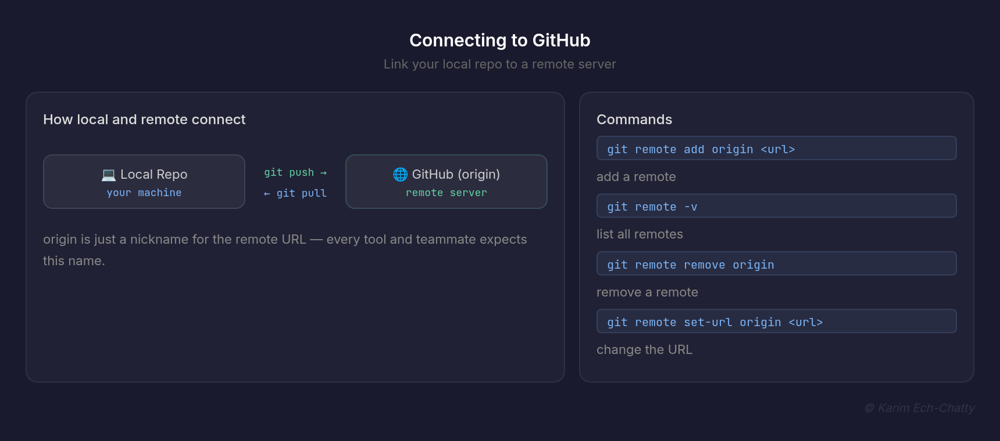
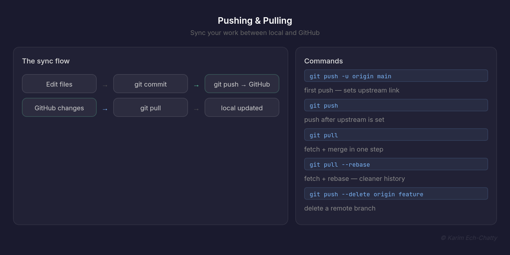
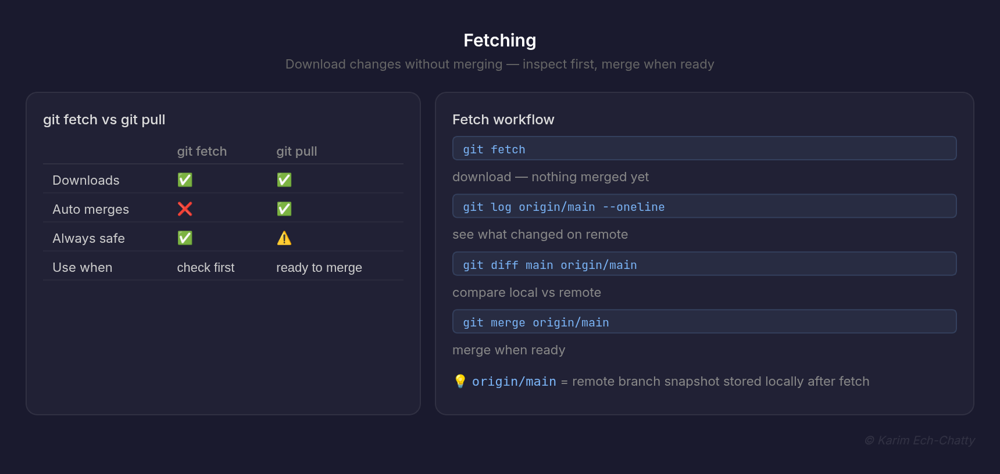
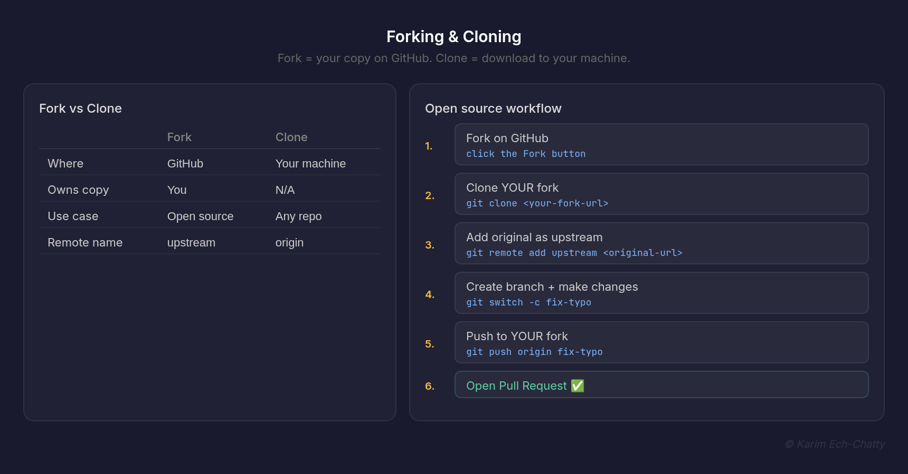
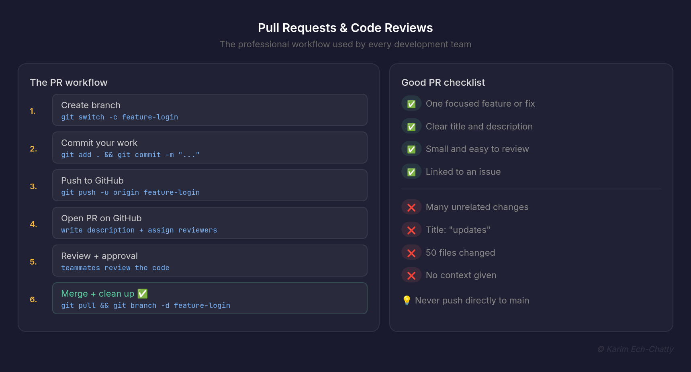
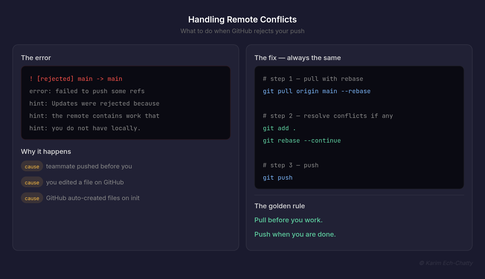

# 5. Collaboration Using GitHub [View all commands for this section](./COMMANDS.md)

In this section, you will learn how to work with others using GitHub. This is the workflow used by professional teams every day.

---

## Connecting to GitHub

Before you can push your local repo to GitHub, you need to connect them. GitHub is just a remote server that hosts your Git repository.



```bash
# Check if you already have a remote
git remote -v

# Add a remote called origin
git remote add origin https://github.com/username/repo-name.git

# Verify it was added
git remote -v
```

**What is `origin`?**
`origin` is just a nickname for the remote URL. You could name it anything but `origin` is the universal convention.

| Command                               | What it does                     |
| ------------------------------------- | -------------------------------- |
| `git remote -v`                       | List all remotes with their URLs |
| `git remote add origin <url>`         | Add a new remote                 |
| `git remote remove origin`            | Remove a remote                  |
| `git remote rename origin upstream`   | Rename a remote                  |
| `git remote set-url origin <new-url>` | Change the remote URL            |

> 💡 Always name your main remote `origin` — every tool and teammate will expect that name.

### To Do

1. Create a new repo on GitHub — leave it completely empty
2. Run `git remote add origin <your-url>`
3. Run `git remote -v` — do you see fetch and push URLs?
4. **Tricky:** what is the difference between the fetch and push URL?

---

## Pushing & Pulling

Pushing sends your local commits to GitHub. Pulling brings GitHub commits to your local machine.



```bash
# Push your branch to GitHub for the first time
git push -u origin main

# After the first time
git push

# Pull latest changes from GitHub
git pull

# Pull from a specific branch
git pull origin main
```

**What `-u` means:**
The `-u` flag sets the upstream — it links your local branch to the remote branch. After running it once, you can just type `git push` or `git pull` without specifying anything extra.

```
Local repo  ──── git push ────▶  GitHub (origin)
Local repo  ◀─── git pull ────  GitHub (origin)
```

| Command                                  | What it does                       |
| ---------------------------------------- | ---------------------------------- |
| `git push -u origin main`                | Push and set upstream (first time) |
| `git push`                               | Push to tracked remote branch      |
| `git push origin feature-login`          | Push a specific branch             |
| `git push --delete origin feature-login` | Delete a remote branch             |
| `git pull`                               | Fetch and merge in one step        |
| `git pull --rebase`                      | Fetch and rebase instead of merge  |

> 💡 Always pull before you push — this avoids rejected pushes caused by someone else pushing before you.

### To Do

1. Push your local repo using `git push -u origin main`
2. Make a change, commit it, and run `git push`
3. Go to GitHub and verify your commit is there
4. Edit a file directly on GitHub, then run `git pull` locally
5. **Tricky:** run `git push` without pulling first after editing on GitHub — what error do you get?

---

## Fetching

`git fetch` downloads changes from GitHub but does NOT merge them into your local branch. It lets you see what changed before deciding to merge.



```bash
# Fetch all changes from origin
git fetch

# Fetch a specific branch
git fetch origin main

# See what changed after fetching
git log origin/main --oneline

# Compare with your local branch
git diff main origin/main

# Merge when ready
git merge origin/main
```

**Fetch vs Pull:**

|                          | `git fetch`             | `git pull`             |
| ------------------------ | ----------------------- | ---------------------- |
| Downloads changes        | ✅                      | ✅                     |
| Merges into local branch | ❌                      | ✅                     |
| Safe to run anytime      | ✅                      | ⚠️ can cause conflicts |
| Use when                 | You want to check first | You are ready to merge |

> 💡 `git fetch` is the safe version of `git pull`. Use it when you want to inspect changes before merging.

### To Do

1. Edit a file directly on GitHub
2. Run `git fetch` locally — no merge happens
3. Run `git log origin/main --oneline` — can you see the new commit?
4. Run `git diff main origin/main` — what changed?
5. Run `git merge origin/main` to bring changes in
6. **Tricky:** what is `origin/main`? How is it different from `main`?

---

## Forking & Cloning

**Cloning** downloads an entire repository to your machine.
**Forking** creates your own copy of someone else's repo on GitHub.



```bash
# Clone a repo
git clone https://github.com/username/repo-name.git

# Clone into a specific folder
git clone https://github.com/username/repo-name.git my-folder

# Clone a specific branch
git clone -b main https://github.com/username/repo-name.git
```

**Fork vs Clone:**

|                       | Fork                        | Clone                       |
| --------------------- | --------------------------- | --------------------------- |
| Where it happens      | On GitHub                   | On your machine             |
| Who owns the copy     | You                         | N/A                         |
| Use case              | Contributing to open source | Working on any repo locally |
| Connected to original | Yes — via upstream          | Yes — via origin            |

**Open source contribution workflow:**

```bash
# 1. Fork on GitHub (click Fork button)

# 2. Clone YOUR fork
git clone https://github.com/YOUR-username/repo-name.git

# 3. Add original as upstream
git remote add upstream https://github.com/ORIGINAL-username/repo-name.git

# 4. Create a branch and make changes
git switch -c fix-typo
git add . && git commit -m "fix typo in README"

# 5. Push to YOUR fork
git push origin fix-typo

# 6. Open a Pull Request on GitHub
```

> 💡 Fork = your copy on GitHub. Clone = download to your machine. You always clone your fork, not the original.

### To Do

1. Fork any public repo on GitHub
2. Clone YOUR fork to your machine
3. Add the original as upstream: `git remote add upstream <url>`
4. Run `git remote -v` — you should see both origin and upstream
5. **Tricky:** how would you get the latest changes from the original into your fork?

---

## Pull Requests & Code Reviews

A Pull Request (PR) is a way to propose changes. Instead of pushing directly to main, you push to a branch and ask teammates to review before merging.



**The professional PR workflow:**

```bash
# 1. Create a feature branch
git switch -c feature-login

# 2. Work on your feature
git add . && git commit -m "add login form"
git add . && git commit -m "add login validation"

# 3. Push to GitHub
git push -u origin feature-login

# 4. Go to GitHub — click "Compare & pull request"
# Write a description and assign reviewers

# 5. After approval — merge on GitHub

# 6. Clean up locally
git switch main
git pull
git branch -d feature-login
```

**What makes a good PR:**

| ✅ Good PR                  | ❌ Bad PR              |
| --------------------------- | ---------------------- |
| One focused feature or fix  | Many unrelated changes |
| Clear title and description | Title: "updates"       |
| Small and easy to review    | 50 files changed       |
| Linked to an issue          | No context given       |

> 💡 Never push directly to main on a shared project. Always use branches and Pull Requests — even when working alone. It builds good habits.

### To Do

1. Create a branch `feature-about-page`
2. Add an `about.html` file and commit it
3. Push the branch: `git push -u origin feature-about-page`
4. Open a Pull Request on GitHub with a clear description
5. Merge it on GitHub
6. Pull changes locally: `git pull`
7. Delete the local branch: `git branch -d feature-about-page`

---

## Handling Remote Conflicts

A remote conflict happens when you try to push but GitHub has commits you don't have locally. Git rejects your push to protect those commits.



**The error:**

```bash
! [rejected] main -> main (fetch first)
error: failed to push some refs
hint: Updates were rejected because the remote contains
hint: work that you do not have locally.
```

**Why it happens:**

| Cause                                 | Example                               |
| ------------------------------------- | ------------------------------------- |
| Teammate pushed before you            | They committed while you were working |
| You edited on GitHub directly         | Added a file on GitHub website        |
| GitHub created files on repo creation | Added README or LICENSE automatically |

**The fix:**

```bash
# Step 1 — Pull with rebase
git pull origin main --rebase

# Step 2 — Resolve conflicts if any appear
git add .
git rebase --continue

# Step 3 — Push
git push
```

**The golden rule:**

```
Pull before you work.
Push when you are done.
```

> 💡 `--rebase` keeps your history clean instead of creating a messy merge commit every time you pull.

### To Do

1. Edit a file directly on GitHub
2. Make a different change locally and commit it
3. Try `git push` — you should see the rejected error
4. Run `git pull origin main --rebase`
5. Push again — it should work now
6. **Tricky:** run `git log --oneline` — is the history linear or does it have a merge commit?

---

**From Learner to Leader**
Made with ❤️ by [Karim Ech-Chatty](https://www.linkedin.com/in/karim-chatty)
