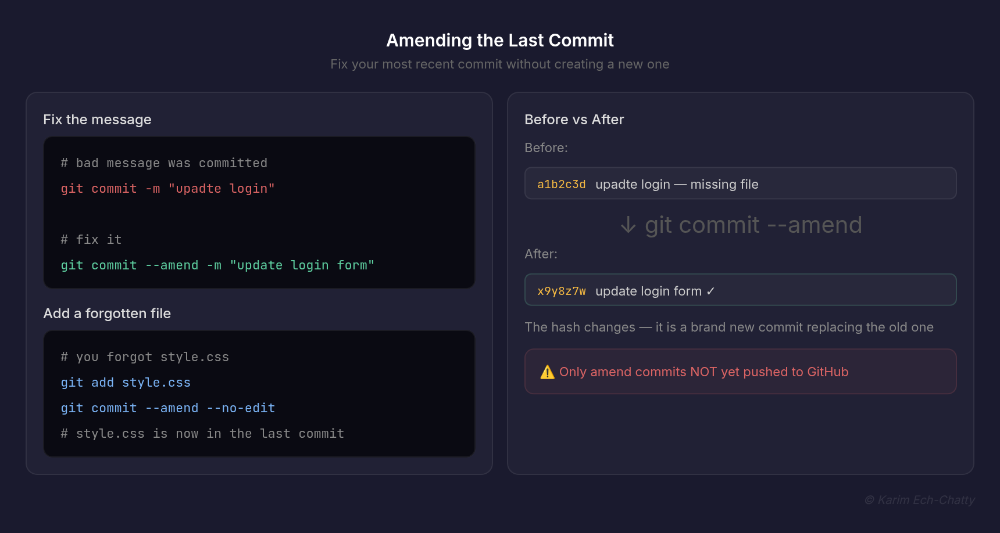
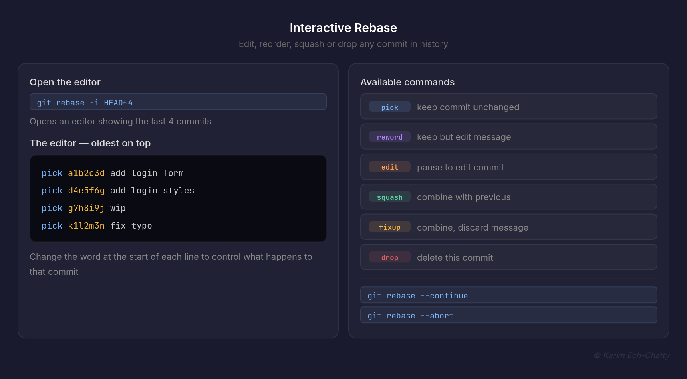
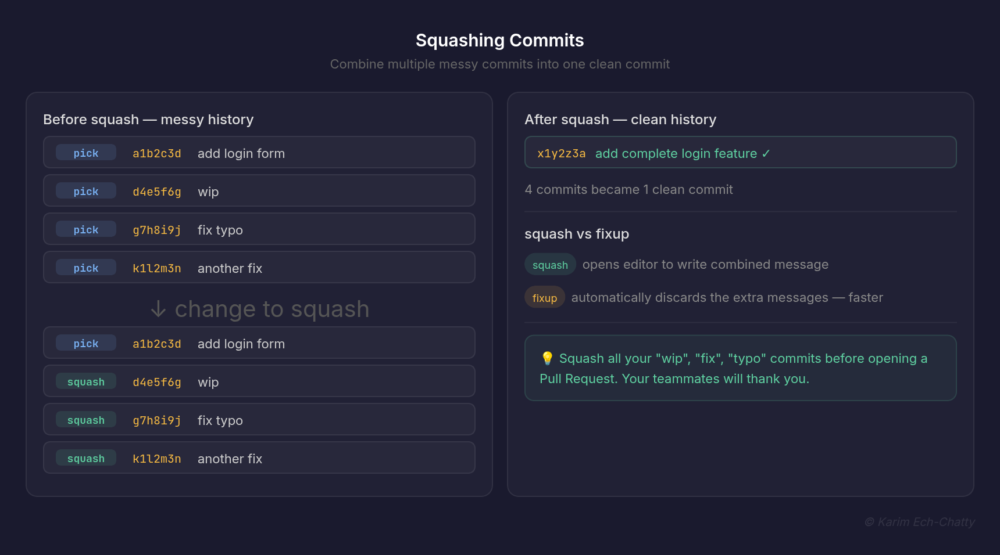
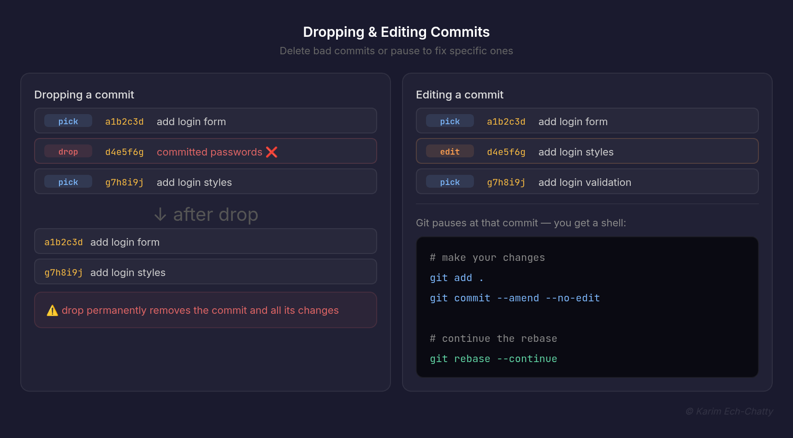
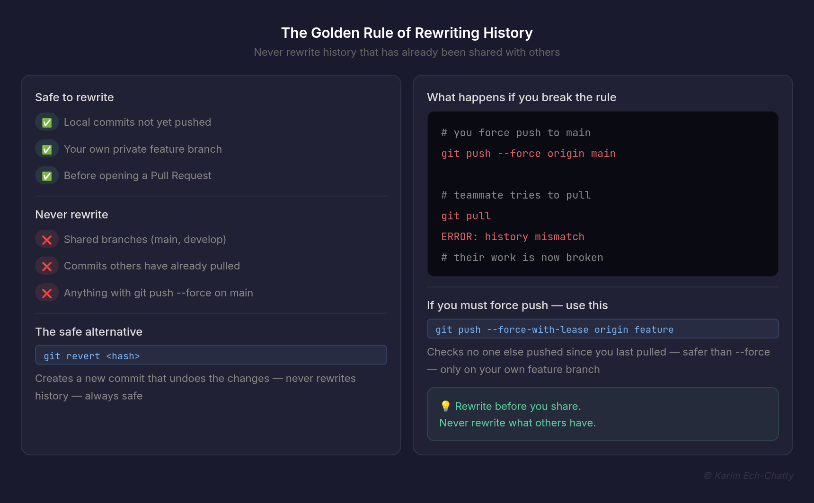
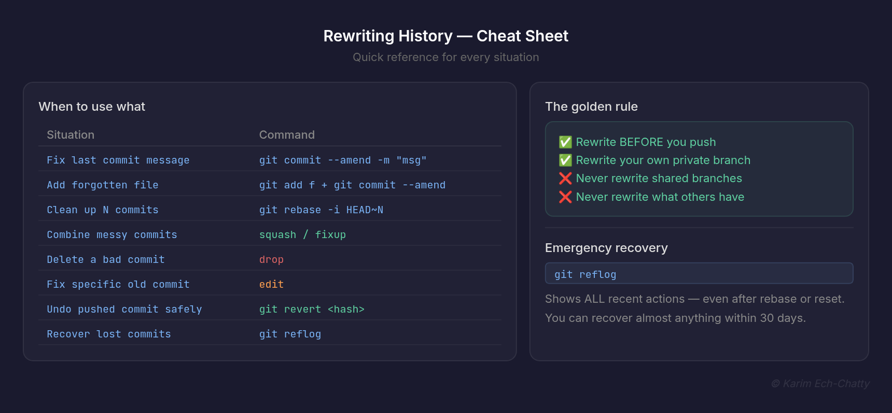

# 6. Rewriting History [View all commands for this section](./COMMANDS.md)

In this section, you will learn how to clean up mistakes and maintain a professional commit history. This is where beginners become advanced Git users — use these tools with care.

---

## Amending the Last Commit

`git commit --amend` lets you fix your most recent commit — change the message, add forgotten files, or remove files — without creating a new commit.



```bash
# Fix only the commit message
git commit --amend -m "correct message here"

# Add a forgotten file to the last commit
git add forgotten-file.js
git commit --amend --no-edit

# Change message AND add a file
git add forgotten-file.js
git commit --amend -m "add login form and validation"
```

**Real example:**

```bash
# You just committed but forgot to add style.css
git add style.css
git commit --amend --no-edit
# style.css is now part of the last commit — no new commit created
```

**What `--no-edit` means:**
It keeps the existing commit message without opening the editor.

| Command                        | What it does                       |
| ------------------------------ | ---------------------------------- |
| `git commit --amend -m "msg"`  | Fix the last commit message        |
| `git commit --amend --no-edit` | Add files without changing message |
| `git commit --amend`           | Opens editor to change message     |

> ⚠️ Only amend commits that have NOT been pushed to GitHub yet.
> Amending a pushed commit rewrites history and will cause problems for teammates.

### To Do

1. Make a commit with a typo in the message
2. Run `git commit --amend -m "correct message"` to fix it
3. Run `git log --oneline` — the old message should be gone
4. Make another commit, then create a new file but forget to add it
5. Run `git add newfile.js` then `git commit --amend --no-edit`
6. Run `git show HEAD` — is the forgotten file now part of the commit?

---

## Interactive Rebase

Interactive rebase is one of the most powerful Git tools. It lets you go back in history and edit, reorder, squash, or drop any commit — making your history look exactly how you want.



```bash
# Open interactive rebase for last 3 commits
git rebase -i HEAD~3

# Open interactive rebase for last 5 commits
git rebase -i HEAD~5
```

**The interactive rebase editor:**

```
pick a1b2c3d add login form
pick d4e5f6g add login styles
pick g7h8i9j fix typo in login

# Commands:
# pick   = keep the commit as is
# reword = keep commit but edit message
# edit   = pause and edit the commit
# squash = combine with previous commit
# fixup  = combine but discard this message
# drop   = delete this commit entirely
```

**How to use each command:**

| Command  | What it does                                        |
| -------- | --------------------------------------------------- |
| `pick`   | Keep the commit unchanged                           |
| `reword` | Keep commit — edit its message                      |
| `edit`   | Pause rebase to edit the commit                     |
| `squash` | Combine with previous commit — keep both messages   |
| `fixup`  | Combine with previous commit — discard this message |
| `drop`   | Delete this commit entirely                         |

> 💡 The list shows commits from oldest (top) to newest (bottom).
> Change the word at the start of each line to control what happens.

### To Do

1. Make 4 commits with simple changes
2. Run `git rebase -i HEAD~4`
3. Change one `pick` to `reword` — save and update the message
4. Run `git log --oneline` — do you see the new message?
5. **Tricky:** reorder two commits by swapping their lines in the editor — does it work?

---

## Squashing Commits

Squashing combines multiple commits into one clean commit. This is useful when you have many small "work in progress" commits that you want to clean up before merging.



```bash
git rebase -i HEAD~3
```

**Before squashing:**

```
pick a1b2c3d add login form
pick d4e5f6g wip
pick g7h8i9j fix typo
```

**After changing to squash:**

```
pick a1b2c3d add login form
squash d4e5f6g wip
squash g7h8i9j fix typo
```

**Git opens a new editor to write the combined message:**

```
# This is a combination of 3 commits.
add login form
wip
fix typo

# Write your final message:
add complete login feature
```

**After squashing:**

```
pick x1y2z3a add complete login feature
```

Three commits become one clean commit.

**Using `fixup` instead of `squash`:**

```
pick a1b2c3d add login form
fixup d4e5f6g wip
fixup g7h8i9j fix typo
```

`fixup` does the same as squash but automatically discards the extra messages — faster when you don't need them.

> 💡 Squash all your messy "wip", "fix", "typo" commits before
> opening a Pull Request. Your teammates will thank you.

### To Do

1. Make 4 commits:

```bash
git commit -m "add login form"
git commit -m "wip"
git commit -m "fix typo"
git commit -m "another fix"
```

2. Run `git rebase -i HEAD~4`
3. Keep the first as `pick`, change the rest to `squash`
4. Write a clean final message: "add complete login feature"
5. Run `git log --oneline` — you should now have one clean commit
6. **Tricky:** what is the difference between `squash` and `fixup`?

---

## Dropping & Editing Commits

You can delete commits entirely or pause to edit them during an interactive rebase.



**Dropping a commit:**

```bash
git rebase -i HEAD~4
```

Change `pick` to `drop` for any commit you want to delete:

```
pick a1b2c3d add login form
drop d4e5f6g accidentally committed passwords
pick g7h8i9j add login styles
pick k1l2m3n add login validation
```

> ⚠️ Dropping a commit permanently removes it from history.
> Everything that commit changed will be gone.

**Editing a commit:**
Change `pick` to `edit`:

```
pick a1b2c3d add login form
edit d4e5f6g add login styles
pick g7h8i9j add login validation
```

Git will pause at that commit and give you a shell:

```bash
# Make your changes
git add .
git commit --amend --no-edit

# Continue the rebase
git rebase --continue
```

**Other useful commands during rebase:**

| Command                 | What it does                         |
| ----------------------- | ------------------------------------ |
| `git rebase --continue` | Move to the next step                |
| `git rebase --abort`    | Cancel and go back to original state |
| `git rebase --skip`     | Skip the current conflicting commit  |

### To Do

1. Make 4 commits — include one bad commit in the middle
2. Run `git rebase -i HEAD~4`
3. Change the bad commit to `drop`
4. Run `git log --oneline` — is the bad commit gone?
5. **Tricky:** what happens to the commits that came AFTER the dropped commit? Do their hashes change?

---

## The Golden Rule

> ⚠️ **Never rewrite history that has already been pushed to a shared branch.**

When you rebase or amend a pushed commit, Git creates brand new commits with different hashes. Anyone who already has the old commits will have a broken history — causing serious conflicts.



**Safe to rewrite:**

| Situation                          | Safe?           |
| ---------------------------------- | --------------- |
| Local commits not yet pushed       | ✅ Always safe  |
| Your own private branch on GitHub  | ✅ Usually safe |
| Shared branch (main, develop)      | ❌ Never safe   |
| Commits others have already pulled | ❌ Never safe   |

**What happens if you break the rule:**

```bash
# You rebase and force push to a shared branch
git push --force origin main

# Your teammate tries to pull
git pull
# ERROR — their history no longer matches yours
# They will have to reset and lose their work
```

**The only exception — `--force-with-lease`:**

```bash
git push --force-with-lease origin my-feature-branch
```

This is safer than `--force` because it checks that no one else has pushed to the branch since you last pulled. Use it only on your own feature branches — never on main.

**The safe workflow:**

```bash
# Rewrite history BEFORE pushing
git rebase -i HEAD~3
# clean up commits...
git push -u origin feature-login  # first push after cleanup — safe

# Never do this on a shared branch:
git rebase -i HEAD~3
git push --force origin main  # ❌ DANGEROUS
```

> 💡 A simple rule to remember:
> **Rewrite before you share. Never rewrite what others have.**

### To Do

1. Make 3 commits locally — DO NOT push yet
2. Run `git rebase -i HEAD~3` and squash them into one
3. Now push for the first time — this is safe
4. Make another commit and push it
5. Try to amend the pushed commit and force push — what warning do you get?
6. **Tricky:** run `git reflog` — can you still see the original commits before the rebase?

---

## Recap — When to Use Each Tool



| Situation                         | Tool to use                                     |
| --------------------------------- | ----------------------------------------------- |
| Fix last commit message           | `git commit --amend -m "msg"`                   |
| Add forgotten file to last commit | `git add file` + `git commit --amend --no-edit` |
| Clean up last N commits           | `git rebase -i HEAD~N`                          |
| Combine messy commits into one    | `squash` or `fixup` in interactive rebase       |
| Delete a bad commit               | `drop` in interactive rebase                    |
| Fix a specific old commit         | `edit` in interactive rebase                    |
| Undo a pushed commit safely       | `git revert <hash>` (does not rewrite history)  |

---

**From Learner to Leader**
Made with ❤️ by [Karim Ech-Chatty](https://www.linkedin.com/in/karim-chatty)
