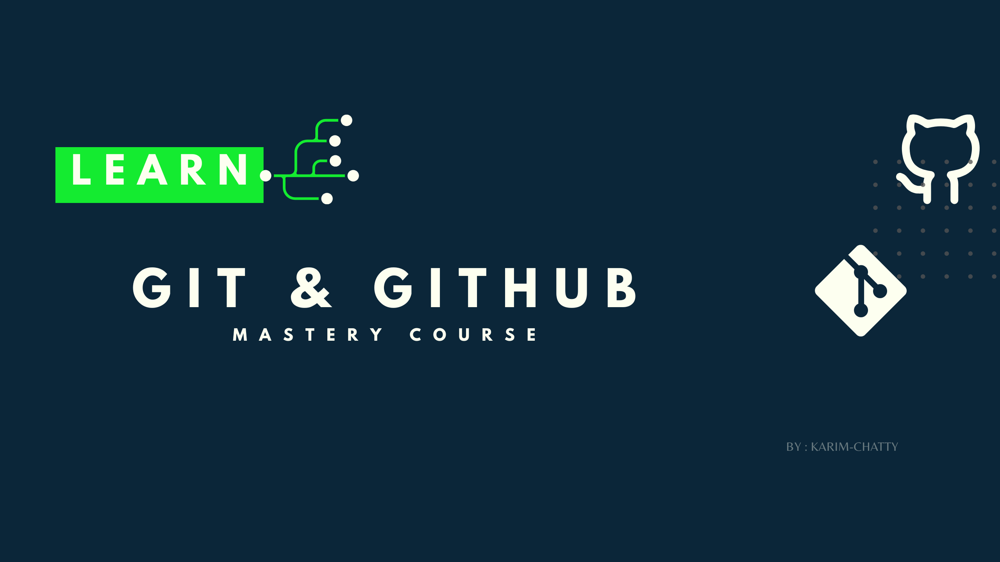

# Table of Contents

1. [Fundamental Concepts](#1-fundamental-concepts)
2. [Creating Snapshots](#2-creating-snapshots)
3. [Browsing Project History](#3-browsing-project-history)
4. [Branching & Merging](#4-branching--merging)
5. [Collaboration Using GitHub](#5-collaboration-using-github)
6. [Rewriting History](#6-rewriting-history)

---

## 1. Fundamental Concepts

In this section, you will build a solid mental model of Git, what it is, why it exists, and how it works under the hood. This foundation will make every other section much easier to understand.

- What is Git?
- How Git works
- Installing Git
- Configuring Git
- The three stages
- The Git workflow

## 2. Creating Snapshots

In this section, you will learn how to tell Git what to track and when to save your progress. Every commit is a snapshot of your project at a specific point in time.

- Initializing a repository
- Tracking & staging files
- Making your first commit
- Ignoring files with `.gitignore`
- Viewing the status
- Viewing differences

---

## 3. Browsing Project History

In this section, you will learn how to navigate and search your project history. Git stores everything — and knowing how to read that history is a superpower.

- Viewing commit history
- Filtering & formatting logs
- Viewing a specific commit
- Comparing commits
- Finding bugs with `git bisect`
- Tracing changes with `git blame`

---

## 4. Branching & Merging

In this section, you will learn how to work on multiple things at once without breaking your main code. Branching is one of Git's most powerful and essential features.

- What is a branch?
- Creating & switching branches
- Fast-forward merges
- 3-way merges
- Resolving merge conflicts
- Rebasing

---

## 5. Collaboration Using GitHub

In this section, you will learn how to work with others using GitHub. This is the workflow used by professional teams every day.

- Connecting to GitHub
- Pushing & pulling
- Fetching
- Forking & cloning
- Pull requests & code reviews
- Handling remote conflicts

---

## 6. Rewriting History

In this section, you will learn how to clean up mistakes and maintain a professional commit history. This is where beginners become advanced Git users — use these tools with care.

- Amending the last commit
- Interactive rebase
- Squashing commits
- Dropping & editing commits
- The golden rule

---

**From Learner to Leader**
Made with ❤️ by [KARIM ECH-CHATTY](https://www.linkedin.com/in/karim-chatty)
